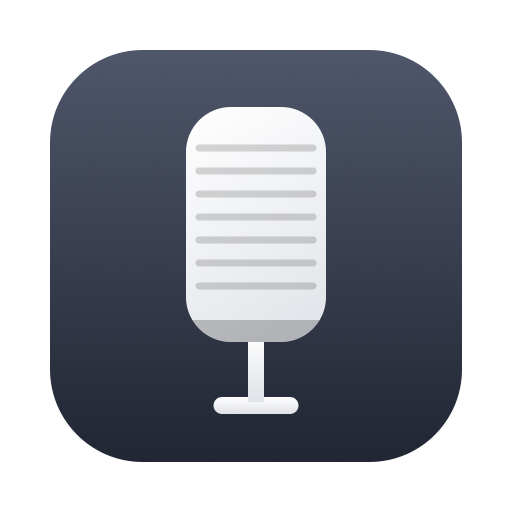

<div align="center">



# Yap

**Blazing-fast voice dictation for macOS that works anywhere you can type.**

[](LICENSE)
[](https://www.apple.com/macos/)
[](https://swift.org)

Press a shortcut, talk, press it again. Your words land in whatever text field you were
using. No account, no API key, no audio leaving your machine.

Built by [Frigade](https://frigade.com).

<video src="https://github.com/FrigadeHQ/yap/raw/main/assets/yap-demo.mp4" controls width="720"></video>

[Watch the demo](https://github.com/FrigadeHQ/yap/raw/main/assets/yap-demo.mp4)

</div>

---

## What it does

Yap lives in your menu bar and waits for a shortcut. Trigger it and a small window appears
near the bottom of the screen with a live waveform and a running preview of what you have
said so far. Press the shortcut again and the text gets pasted into the app you were
already working in. Every transcript is saved locally, so you can go back and copy
something again later.

The default shortcut is `⌘⇧D`. You can rebind it, or set a single modifier key instead.
Tapping right shift on its own works nicely if you have a spare thumb.

## Install

### Homebrew

```bash
brew install --cask frigadehq/tap/yap
```

To update later:

```bash
brew upgrade --cask yap
```

### Direct download

Grab the latest `.dmg` from [Releases](https://github.com/FrigadeHQ/yap/releases) and drag
Yap into your Applications folder.

Released builds are signed and notarized, so macOS opens them without complaint.

## Why we built this

There's no shortage of voice to text tools for the Mac, and some of the open source ones are
genuinely good. They tend to have one of two problems. Either you pay for them, or they make
you download a Whisper model that runs to hundreds of megabytes, sits in your RAM, and only
feels fast on a recent, high end Mac. On anything older it drags. Intel Macs get it worst,
because Whisper and NVIDIA's Parakeet both lean on hardware those machines never had.

macOS 26 changed the math. It ships two new APIs, `SpeechAnalyzer` and `SpeechTranscriber`,
that do streaming speech to text on device, on the chips Apple built for it. There's no model
to download, it holds nothing in memory before you start, and it runs without an API key or a
per minute bill. The words show up while you are still talking.

Is Apple's model actually any good? Better than the thing it replaces, as it turns out.
Inscribe [ran it against WhisperKit](https://get-inscribe.com/blog/apple-speech-api-benchmark.html)
on 5,559 LibriSpeech clips: 2.12% word error rate on clean audio and 4.56% on noisy, next to
3.74% and 7.95% for Whisper Small, and about three times the speed.

So Yap ships no model at all. It's roughly three thousand lines of Swift in a 4 MB app, and
it never touches the network. We use it every day at [Frigade](https://frigade.com), mostly
for the long messages nobody wants to type twice.

## Features

- On-device transcription through Apple's Speech framework
- Global shortcut, fully rebindable, with optional single-modifier triggers like right shift
- Pastes straight into the focused field of whatever app you were in
- Local transcript history with search, copy, and delete
- Live waveform and partial transcript while you speak
- Press escape twice to discard a dictation in progress
- Follows your system default microphone, including when it changes mid-session
- Optional launch at login, off by default
- No account, no network calls, no telemetry

## Requirements

macOS 26 (Tahoe) or later. Yap depends on the speech models Apple ships with macOS 26, so
earlier versions will not work. Building from source additionally needs Xcode 26.

## Permissions

On first launch Yap asks for four things, and explains each one:

| Permission | Why |
| --- | --- |
| Microphone | To hear you |
| Speech Recognition | To transcribe on device |
| Accessibility | To see which app you are typing into |
| Automation | To paste the result into it |

Accessibility has to be switched on by hand in System Settings. macOS requires that of any
app that types on your behalf, and there is no way to grant it programmatically.

## How it works

Audio comes off the default input through `AVAudioEngine` and gets converted to whatever
format the analyzer asks for. Capture starts before the speech stack finishes initializing,
and buffers recorded in that window are held and flushed once the transcriber attaches, so
the first word of a sentence is never clipped.

Transcription runs through `SpeechAnalyzer` with volatile results turned on, which is what
gives you the live preview. `SFSpeechRecognizer` is wired up as a fallback for locales the
newer API does not cover.

Insertion is the awkward part. Yap writes the text to the clipboard, drives `⌘V` through
System Events, then restores your previous clipboard contents. It waits before restoring,
because Chromium-based apps read the pasteboard asynchronously and more than once, and
restoring too early hands the renderer stale data. That single detail is the difference
between working everywhere and working only in native apps.

State lives in one place. `RecordingCoordinator` is a small state machine whose dependencies
are all protocols, so the logic is covered by unit tests without needing a microphone.

## Why it is not sandboxed

Typing into another application requires driving System Events and reading the focused UI
element, both of which the macOS App Sandbox forbids. Yap therefore ships unsandboxed and is
distributed outside the Mac App Store. Every text expander, clipboard manager, and dictation
tool on macOS lands in the same place for the same reason.

## Roadmap

There is not much of one, and that is on purpose. Yap does a single thing, and keeping it
small enough that you never have to think about it is the main design principle. Most
feature ideas make an app like this worse.

We are not precious about it though. If something is missing that you would use every day,
open an issue or send a pull request and we will give it a fair hearing. A language picker
is the most likely next addition, since Yap follows your system locale today.

## Development

Build and install from source in one line. It clones, builds, drops Yap into `/Applications`,
and launches it:

```bash
git clone https://github.com/FrigadeHQ/yap.git && cd yap && ./install.sh
```

The script installs XcodeGen if you do not have it, quits any running copy, and replaces it
with the new build. Re-run `./install.sh` any time to rebuild after a change.

If you would rather work in Xcode:

```bash
xcodegen generate                    # writes Yap.xcodeproj from project.yml
open Yap.xcodeproj                   # then run with ⌘R
```

The Xcode project is generated rather than committed, so configuration changes stay readable
in a diff.

Run the tests with:

```bash
xcodebuild -project Yap.xcodeproj -scheme Yap -destination 'platform=macOS' test
```

One thing to know about local builds. They are signed ad-hoc, which gives them no stable
identity, so macOS treats every rebuild as a brand new application and forgets the
permissions you granted the previous one. The symptom is confusing: the checkbox still looks
switched on in System Settings, but pasting quietly stops working. There is a
"Reset and re-grant" button in Settings for exactly this. Released builds are signed
properly and do not have the problem.

The app icon is generated too, if you want to change it:

```bash
swift Tools/GenerateIcon.swift /tmp/Yap.iconset
iconutil -c icns /tmp/Yap.iconset -o Sources/Yap.icns
```

## Contributing

Issues and pull requests are welcome. If you are fixing a paste failure in a specific app,
please say which app and which macOS version, since that class of bug is almost always
app-specific.

## License

MIT. See [LICENSE](LICENSE).

---

<div align="center">

Built by [Frigade](https://frigade.com), an AI assistant that lives inside your product,
learns it end to end, and takes actions on behalf of your users.

</div>
